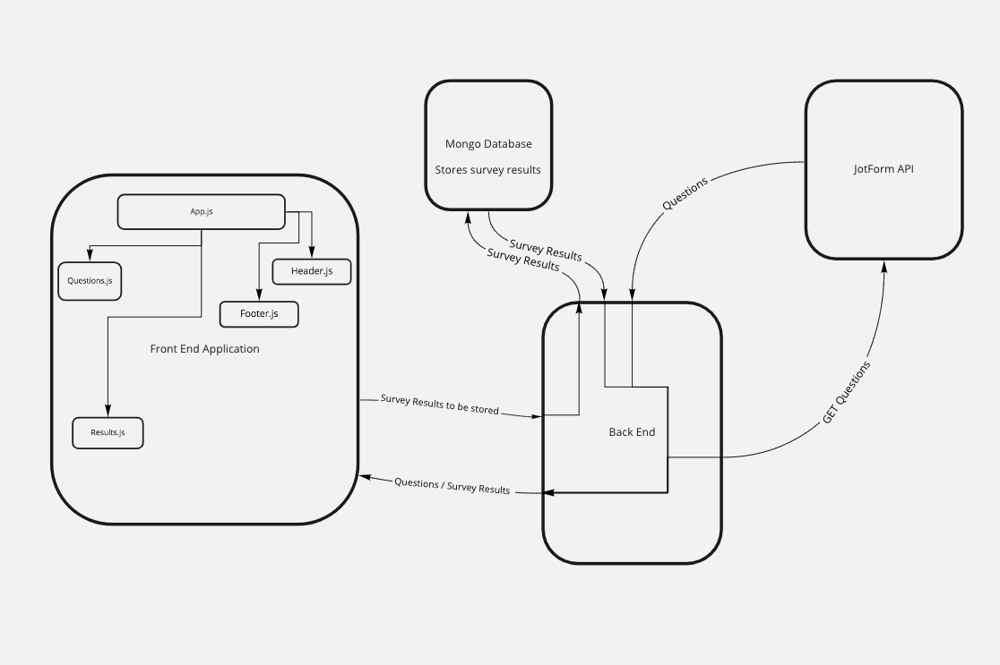

# **The Tech Prospective Survey**

## **Survey URL**

[Tech Perspective Survey](https://tech-perspective-survey.netlify.app/admin)

## **The vision**


- The vision compiling diversity data and using it as a teaching tool to bring to light internal biases and ways to be more conscious with regard to inclusivity and diversity .

## **The Problem Domain**

- This project will revolutionize the existing survey data, making it more user friendly and potentially caching historical data.

## **The Importance**

- This product will drastically improve the awareness of internalized biases, discrimination and privilege based on a multitude of factors. This product will serve to bring about a more inclusive and self-aware team.

### **The Project Scope (In/Out)**


#### *In Scope*

*Allow the Admin user to...*

- Access the survey.
- Complete the survey.
- View data on a stylized graph.
- Compare data by multiple students in one class.
- See how many students participate in the survey.

#### *Out of Scope*

- Data from other schools and students will not be visible.
- New students' data from other schools cannot be added.

### Minimum Viable Product


- **What will your MVP functionality be?**
  - Access and complete the survey.
  - Store immediate survey data in the DB.
  - Render a stylized graph of the immediate data.

### Stretch Goals

- **What are your stretch goals?**
  - Cache historical data.
  - Develop a graph modeling historical data.
  - Allow the user to access historical data and trends.
- **What stretch goals are you going to aim for?**
  - The ability to store historical data.

## **Software Requirements**

### **Functional Requirements**

- User will be able to complete the survey and submit data.
- User will be able to access a stylized graph of the immediate data.
- User will be able to secure data and login information.

### **Non-Functional Requirements**

- **Security**
  - Our app will use Auth0 to make sure we have authorized users
  - This will allow us to track and personalize to our users
  - Our backend will validate requests to make sure it is coming from our front end
  - Managing the uses of our api and databases so only our users are able to access those resources

- **Database**
  - Each item belongs to a single location
  - The two databases will be a Student database and a Class database
    - There will be a identifier in the DB associated with the class
  - Each student will have a single class

### **Data Flow**



### DataBase Schemas

```js

ClassSurvey = {
  ClassNumber : Number,
  Identifier : String,
  ClassCount : Number,
  Instructor : String,
  thumbnail : String, //url
  note: String //optional
}
```

## How To Use **The Tech Perspective Survey**

## Step One

- begin by running:
- `git clone` then copy and paste `git@github.com:Meltingpot-Data/techperspective-front.git`

- Do the same for the backend repo:
- `git clone` then copy and paste `git@github.com:Meltingpot-Data/techperspective-back.git`

## Step Two

- run: `cd techperspective-front`
- then (installs node modules): `npm install`
- then (installs dependencies): `npm i express bootstrap nodemon cors dotenv mongoose jwt bcrypt base-64 supertest sqlite3 jsonwebtoken`
- repeat **step two** for 'back'

## Step Three

- Your are going to need to create a `.env` in order to use the server, follow the guide in the provided `.sample.env` file.

## How to Use

- Click on the provided link here: [Survey Admin Portal](https://tech-perspective-survey.netlify.app/admin)

## To start server

- run: `npm start`
*To test the server*

- run: `npm run test`
*To run the tests*

## **Team Meltingpot-Data**


## Our Cooperation Plan

### Team Key Strengths?

**Erik** Program Management, React, JavaScript, teamwork, bootstrap-react
**Joey** Front-end Design, creative, communication, leadership, team building, all-around BA
**Emily** Front-end design, layout and CSS
**Ryan** Cool bird Dad, testing/bug hunting, Master of parrot gifs
**Michael** Backend creation, Javascript development and problem solving

**How are we going to utilize these strengths?**

- **Emily** and **Joey** will take point on the creative styling and UI.
- **Ryan** and **Michael** will tackle the backend development.
- **Joey** and **Erik** will co-lead the team and ensure all docs and details are submitted and taken care of.

### Team Professional Competencies

1. **Joey** wants to work on leadership and project management.
2. **Erik** wants to work on communication and making his presentations sound more natural.
3. **Emily** would like to refine her teamwork skills.
4. **Michael** Would like to improve his communication and public speaking.
5. **Ryan** endeavors to hone his technical skills.

### Day to day work schedule

- 9:00am to 6:00pm 12pm-2pm lunch designed but open to interpretation.
- Morning standup to go over what is planned.
- Afternoon (~5:00PM) will be bringing all the code together and planning for the next day/

## Conflict Plan

- **Conflict Resolution**
  - One-on-one discussion,
  - Mediation with another group member,
  - Group discussion,
  - Elevate to the next level as necessary.

## Communication Plan

### **Availability**

- **Joey** 12AM cutoff (but is an insomniac - available for friends at all times)
- **Erik** 12AM
- **Emily** 12AM (EST)
- **Michael** 12AM
- **Ryan** 12AM but also available whenever

### **Communication Platforms?**

- Slack
- Remo
- Zoom/Discord

### Breaks an off hours

- As needed but will have planned lunch
- If we start to fall behind?
  - Reevaluate what is MVP for us
- *Communication on off hours*
  - Slack
  - text (for urgent needs)

### Making sure to hear all voices

- Everyone will be sharing at stand up and stand down.
- Frame responses with mutual respect.

## Diversity Equity and Inclusion Plan

- **Joey** is going to do his best to check his internal biases and assumptions of others.
- **Erik** speak up in challenging situations and bravery.
- **Emily** wants to work on not being so mean to men and take action to reduce stressful situations.
- **Michael** wants to ensure all voices are heard.
- **Ryan** wants to work on examining his assumptions.

## Work Plan

### **Tools for collaboration and workflow**

- We will be creating a task list to manage things from our Trello board.
- LiveShare on VS code.

### **Git Process**

- Frontend and backend will live on the GitHub
- Making an organization
- Working on own branches
- Push to staging and test
- Otherwise push as needed

### **PR Processes**

- Two other reviews for main
- One for staging
- Merging hopeful once a day but as necessary

### **Credit and Co-Conspirators**

- This amazing final project was thoughtfully created and masterfully crafted by the master-minds of **Erik Savage**, **Michael Metcalf**, **Joey Hernandez**, **Emily Landers**, and **Ryan Lee**!

### **Contact the Team**

[Follow Joey on LinkedIn](https://www.linkedin.com/in/jmhernandez2six/)

[Follow Erik on LinkedIn](https://www.linkedin.com/in/erikksavage/)

[Follow Emily on LinkedIn](https://www.linkedin.com/in/emily-landers-/)

[Follow Michael on LinkedIn](https://www.linkedin.com/in/mt-metcalf/)

[Follow Ryan on LinkedIn](https://www.linkedin.com/in/ryanyinlee/)
